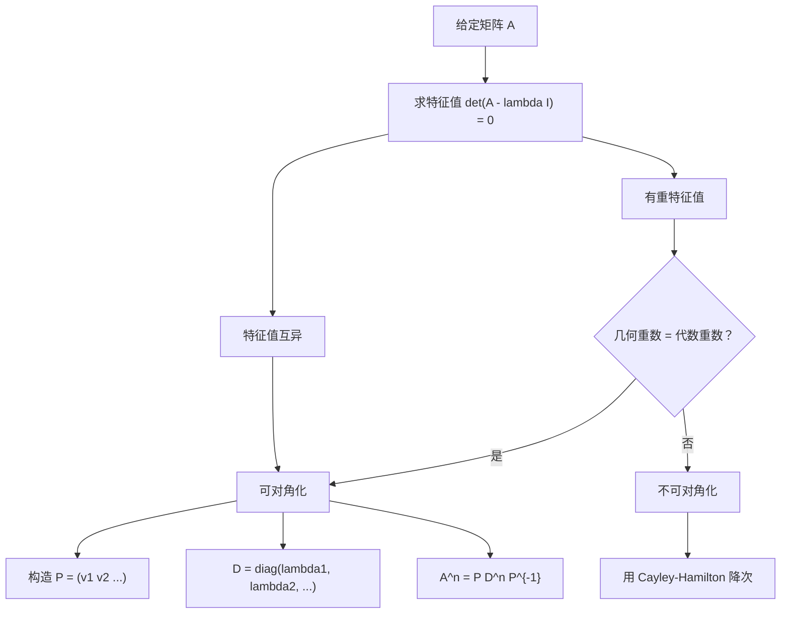

# Matrices 解题方法

## 整体判定流程

---

## Method 1: 求特征值

**步骤**：

1. 设 $A - \lambda I$，其中 $I$ 为单位矩阵
2. 计算 $\det(A - \lambda I) = 0$
3. 展开行列式得到特征多项式
4. 因式分解求解 $\lambda$

**对于 $2 \times 2$ 矩阵**：
$$
\det\begin{pmatrix} a-\lambda & b \\ c & d-\lambda \end{pmatrix} = \lambda^2 - (a+d)\lambda + (ad-bc) = 0
$$

**对于 $3 \times 3$ 矩阵**：
- 使用第一行展开或 Sarru 法则
- 注意符号规律：$+ - +$

---

## Method 2: 求特征向量

**步骤**：

1. 对每个特征值 $\lambda_i$，写出 $(A - \lambda_i I)$
2. 解齐次线性方程组 $(A - \lambda_i I)\mathbf{v} = \mathbf{0}$
3. 取非零解（通常取一个自由变量为 $1$）

**注意**：
- 特征向量不唯一，可取任意非零倍数
- $k\mathbf{v}$（$k \neq 0$）仍为特征向量

---

## Method 3: Cayley-Hamilton 定理

**步骤**：

1. 求出特征方程 $p(\lambda) = 0$
2. 将 $\lambda$ 替换为 $A$：$p(A) = 0$
3. 整理得 $A$ 的多项式表达式

**求 $A^{-1}$**：
$$
A^n + a_{n-1}A^{n-1} + \cdots + a_1A + a_0I = 0
$$
$$
A(A^{n-1} + a_{n-1}A^{n-2} + \cdots + a_1I) = -a_0I
$$
$$
A^{-1} = -\frac{1}{a_0}(A^{n-1} + a_{n-1}A^{n-2} + \cdots + a_1I)
$$

**求 $(A^{-1})^2$**：
- 先求 $A^{-1}$ 表达式
- 再平方

---

## Method 4: 化简矩阵多项式

**技巧**：

- 先用 Cayley-Hamilton 降次
- 然后将多项式除法降阶
- 反复代入直到次数低于特征方程次数

**示例**：若 $A^2 = 5A - 6I$，则
$$
A^3 = A \cdot A^2 = A(5A - 6I) = 5A^2 - 6A = 5(5A - 6I) - 6A = 19A - 30I
$$

---

## Method 5: 对角化

**步骤**：

1. 求所有特征值 $\lambda_1, \lambda_2, \dots$
2. 求对应的特征向量 $\mathbf{v}_1, \mathbf{v}_2, \dots$
3. 构造 $P = (\mathbf{v}_1 \; \mathbf{v}_2 \; \dots)$，$D = \operatorname{diag}(\lambda_1, \lambda_2, \dots)$
4. 计算 $P^{-1}$
5. 验证：$A = PDP^{-1}$

**对于 $2 \times 2$ 矩阵**：
$$
P^{-1} = \frac{1}{\det(P)}\begin{pmatrix} d & -b \\ -c & a \end{pmatrix}
\text{ 其中 } P = \begin{pmatrix} a & b \\ c & d \end{pmatrix}
$$

---

## Method 6: 求矩阵高次幂

**步骤**：

1. 将对角化结果 $A = PDP^{-1}$
2. $A^n = PD^nP^{-1}$
3. $D^n = \operatorname{diag}(\lambda_1^n, \lambda_2^n, \dots)$
4. 代入计算

**注意**：若需要 $f(A) = (pA + qI)^n$，则 $f(A) = P f(D) P^{-1}$，其中
$$
f(D) = \operatorname{diag}((p\lambda_1 + q)^n, (p\lambda_2 + q)^n, \dots)
$$
