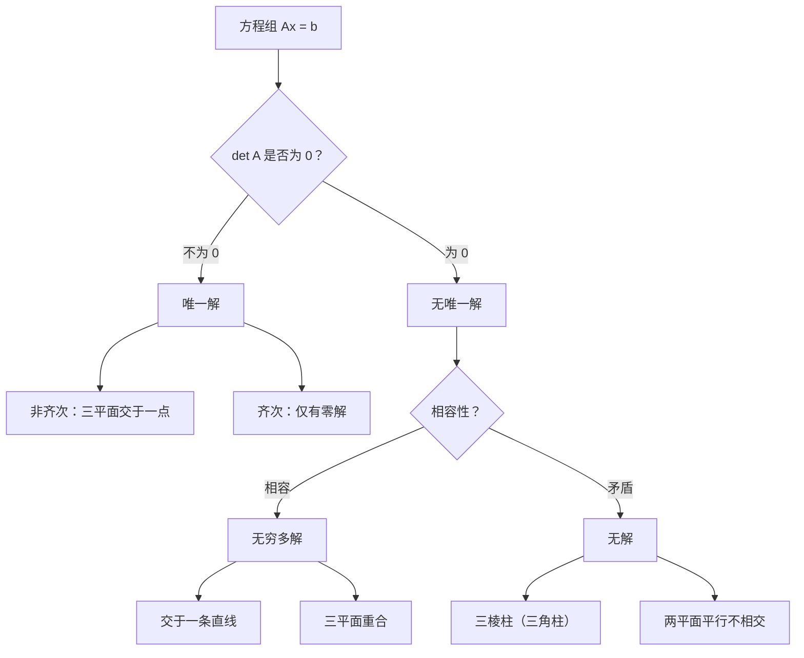

# Systems of Linear Equations 解题方法

---

## Method 1: 判断唯一解

**步骤**：

1. 写出系数矩阵 $A$
2. 计算 $\det A$
3. $\det A \neq 0$ → 唯一解
4. $\det A = 0$ → 无唯一解（继续判断相容性）

**注意**：
- $3 \times 3$ 行列式按第一行展开
- 展开时注意符号：$a_{11}C_{11} - a_{12}C_{12} + a_{13}C_{13}$

---

## Method 2: 判断相容性（Gaussian Elimination）

**步骤**：

1. 写出增广矩阵 $(A|\mathbf{b})$
2. 通过行变换化为行阶梯形
3. 检查是否有矛盾方程

**行变换技巧**：
- 先用第一行消去第二、三行的第一个变量
- 再用新的第二行消去第三行的第二个变量
- 若某行全为零，则降秩

**矛盾判断**：
- 形如 $0 = c$（$c \neq 0$）→ 矛盾，无解
- 没有矛盾且 rank = 变量数 → 唯一解
- 没有矛盾且 rank &lt; 变量数 → 无穷多解

---

## Method 3: 参数化解

**步骤**：

1. 行变换得到行阶梯形
2. 确定自由变量（秩 &lt; 变量数时）
3. 设自由变量为参数（如 $t$, $s$）
4. 回代得到其余变量

**示例**：

阶梯形为：
$$
\begin{cases}
x + y + z = 1 \\
y - z = 2 \\
0 = 0
\end{cases}
$$

设 $z = t$，则 $y = 2 + t$，$x = 1 - (2 + t) - t = -1 - 2t$。

解集为 $\begin{pmatrix} x \\ y \\ z \end{pmatrix} = \begin{pmatrix} -1 \\ 2 \\ 0 \end{pmatrix} + t\begin{pmatrix} -2 \\ 1 \\ 1 \end{pmatrix}$。

---

## Method 4: 几何解释

**判断流程**：

**关键判断**：
- 三个平面两两相交，交线平行 → 三棱柱（triangular prism）
- 其中一个方程与其他两个矛盾 → 某两平面平行
- 三平面重合 → 实际上只有一个独立方程
